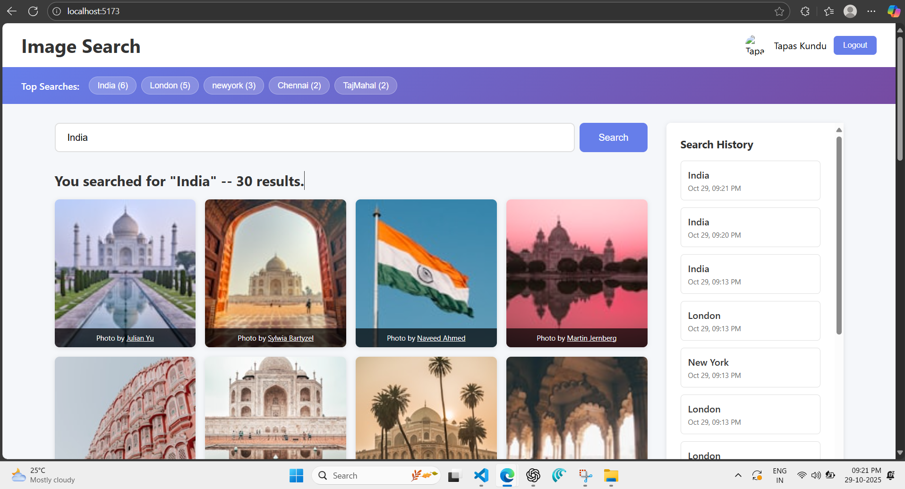
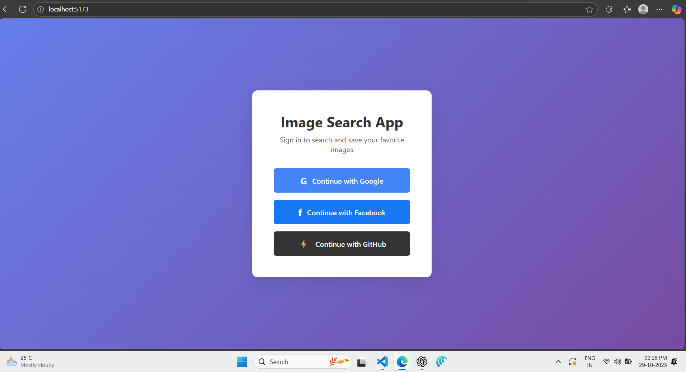

# Image Search & Multi-Select

A full-stack **MERN** application with **OAuth authentication** (Google, Facebook, GitHub) and **image search** powered by **Unsplash API**. Features multi-select image grid, personal search history, and global top searches.

> **Live Demo**: [https://image-search-multi-select.vercel.app/] 

---

## Screenshots

| Dashboard | Login Page |
|---------|------------|
|  |  |
| *Search grid, multi-select counter, top searches banner, history sidebar* | *Clean OAuth login with Google, Facebook, GitHub* |

---

## Features

- **OAuth Login** via Google, Facebook, GitHub (Passport.js)
- **Image Search** using Unsplash API
- **Multi-Select Grid** with checkbox overlay
- **Dynamic Counter**: `Selected: X images`
- **Top 5 Global Searches** banner
- **Personal Search History** (last 20 searches)
- **Protected Routes** – Only logged-in users can search

---

## Tech Stack

| Layer | Technology |
|------|------------|
| **Frontend** | React.js, Axios, React Router |
| **Backend** | Node.js, Express.js |
| **Database** | MongoDB (Mongoose) |
| **Auth** | Passport.js (Google, Facebook, GitHub) |
| **API** | Unsplash Search API |
| **Session** | Express Session + Cookies |

---

## Project Structure

```bash
image-search-multi-select/
├── client/                  # React frontend
│   ├── public/              # index.html, favicon
│   ├── src/
│   │   ├── components/      # LoginButtons, SearchGrid, HistorySidebar
│   │   ├── pages/           # Dashboard.jsx, Login.jsx
│   │   ├── utils/           # api.js (axios instance)
│   │   ├── App.js
│   │   └── index.js
│   └── package.json
│
├── server/                  # Express backend
│   ├── config/              # passport.js
│   ├── middleware/          # ensureAuthenticated.js
│   ├── models/              # User.model.js, Search.model.js
│   ├── routes/              # auth.js, api.js
│   ├── .env                 # Secrets
│   ├── server.js
│   └── package.json
│
├── images/                  # Screenshots
├── videos/                  # Demo videos
├── postman_collection.json  # API testing
└── README.md